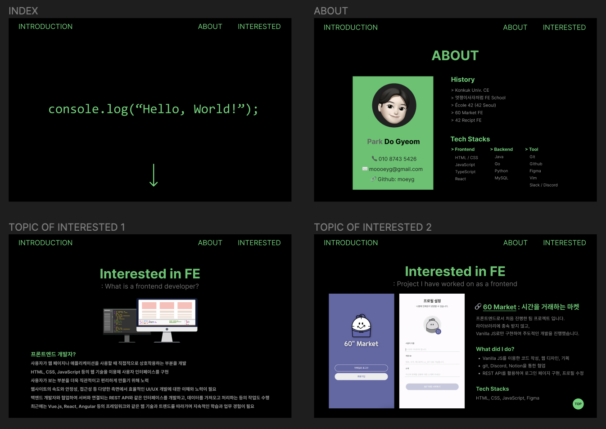

# introduction

웹 프로그래밍 과제로 구현해 본 자기소개 페이지 입니다.  
CSS Flex 기능을 주로 활용하였으며,  
JavaScript로 One scroll page scoll을 중점 구현했습니다.

 

# Tools

HTML, CSS, JavaScript

 

# Figma

 
[Figma](https://www.figma.com/file/N3U5NPLqnHMTomuxMXokiC/Portfolio---Web-term-project?type=design&node-id=1-3&t=OZZOt0NWANcnyvX5-0)

 

# Issue

JavaScript로 One scroll page scoll을 구현하려면,  
우선 html, body의 높이를 100%로 하고, 각 section의 높이를 100vh로 주어야 합니다.  
화면의 뷰포트를 고려해야 하기 때문입니다.
